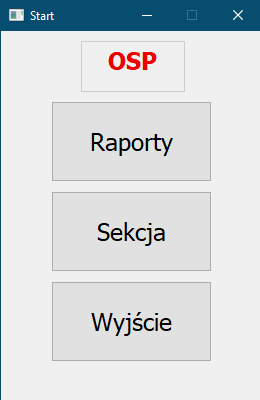
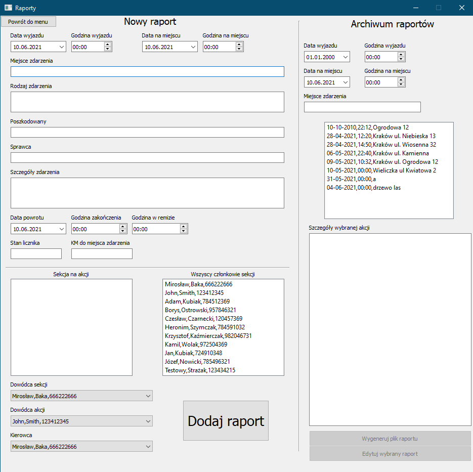
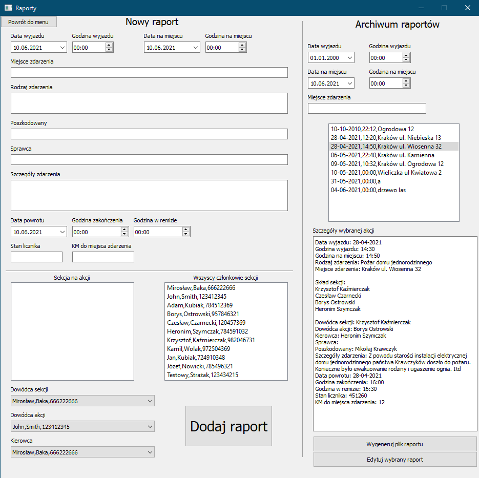
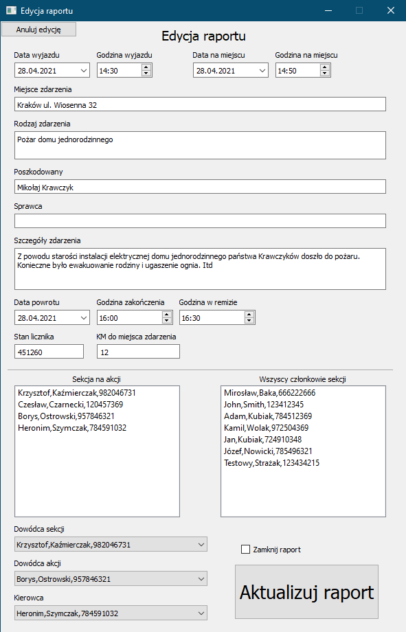
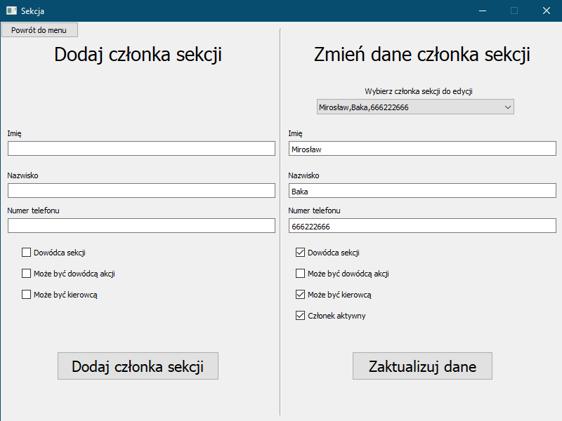

# OSPython
## Autorzy

1. Jakub Cichocki
2. Damian Cyper

## Opis

Projekt jest aplikacją desktopową wykonaną przy pomocy PyQt5, która pomaga w obsłudze raportów OSP. Głównym zadaniem naszej aplikacji jest możliwość dodawania, edytowania i eksportowania do PDF raportów z akcji. Ma również możliwość dodawania i edycji członków OSP. Aplikacja wszystkie gromadzone dane przechowuje w bazie danych firebase. Dostępne w bazie raporty można przeglądać wybierając je z listy (archiwum raportów). Listę tę można oczywiście filtrować w celu wygodniejszego wyszukiwania raportów. Archiwum jest również sortowane po dacie od najnowszego raportu do najstarszego żeby ułatwić pracę przyszłym użytkownikom. Aplikacja oferuje również możliwość zamknięcia raportu - po wybraniu takiej opcji raport przestaje być edytowalny. Taka funkcja może być użyteczna żeby po wygenerowaniu i wydrukowaniu raportu nie było możliwości edycji przez inne osoby.

## Technologie

1. Baza danych Firebase
2. PyQt5
3. Biblioteka do obsługi plików PDF (fpdf2)

## Przegląd aplikacji

1. Po uruchomieniu aplikacji użytkownik widzi ekran startowy:

   

   

2. Jeżeli kliknie w przycisk "Raporty" zostanie przeniesiony do widoku umożliwiającego dodanie nowego raportu oraz przeglądanie archiwum raportów.

   

   

   - Po wybraniu dowolnego raportu z archiwum użytkownik uzyskuje możliwość wygenerowania pliku raportu lub edycji wybranego raportu.

     

     

   - Wybranie opcji "Edytuj wybrany raport " przenosi do nowego okna, w którym użytkownik może edytować wcześniej wprowadzone dane. Może również zamknąć raport, przez co przestanie być edytowalny.

     

3. Jeżeli użytkownik kliknie w przycisk "Sekcja", zostanie przeniesiony do nowego okna, w którym może dodać nowego członka lub zmienić dane już istniejącego.

